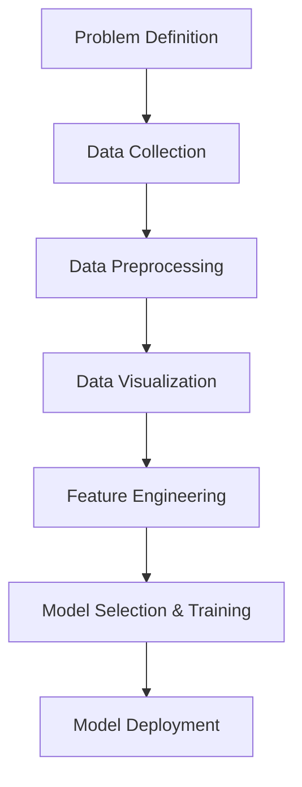

# Machine Learning Principles and Practical Issues - Session Summary

## Session Overview

### Instructor: Dr. Habib
- **Session Focus**: ML principles, practical implementation issues, and real-world applications
- **Teaching Approach**: Interactive discussion with emphasis on understanding terminology before deep implementation
- **Session Structure**: Q&A every 45 minutes, live coding demonstrations

---

## Core Learning Objectives

### Session Goals:
1. **Understand ML Pipeline**: Step-by-step approach to building ML models
2. **Identify Practical Issues**: Common problems faced during implementation
3. **Learn Problem Classification**: When to use ML vs. traditional programming
4. **Master Terminology**: Essential ML concepts and vocabulary

---

## Key Concepts Covered

### 1. When to Use Machine Learning

#### Problem Classification Framework:

| Problem | ML Required? | Reason |
|---------|--------------|--------|
| Calculate age from date of birth | **NO** | Rule-based solution available |
| Predict house prices | **YES** | Needs data to learn pricing patterns |
| Email spam detection | **YES** | Based on text pattern recognition |

#### **Decision Criteria:**
- **Use ML when**: Historical data available, complex patterns exist, traditional programming insufficient
- **Avoid ML when**: Simple rule-based solutions exist, no historical data, straightforward calculations

---

### 2. Machine Learning Pipeline

#### **7-Stage ML Development Process:**



#### **Detailed Stage Breakdown:**

##### Stage 1: Problem Definition
- **Stakeholder Engagement**: Understanding business requirements
- **Use Case Clarification**: Defining clear, measurable objectives
- **Success Metrics**: Establishing performance criteria

##### Stage 2: Data Collection
- **Sources**: Real estate databases, historical records, domain experts
- **Volume**: Sufficient samples for training (thousands of records)
- **Quality**: Relevant, accurate, and representative data

##### Stage 3: Data Preprocessing
- **Data Cleaning**: Handling null values, outliers, inconsistencies
- **Data Formatting**: Converting to suitable formats for analysis
- **Quality Assessment**: Using tools like pandas profiling

##### Stage 4: Data Visualization
- **Purpose**: Understanding data patterns and distributions
- **Tools**: Bar charts, pie charts, statistical plots
- **Stakeholder Communication**: Visual representation of findings

##### Stage 5: Feature Engineering
- **Feature Selection**: Choosing relevant input variables
- **Feature Creation**: Deriving new features from existing data
- **Dimensionality Management**: Reducing irrelevant features

##### Stage 6: Model Selection & Training
- **Algorithm Choice**: Based on problem type (regression/classification)
- **Training Process**: Learning patterns from historical data
- **Hyperparameter Tuning**: Optimizing model parameters

##### Stage 7: Model Deployment
- **Cloud Platforms**: AWS, Azure, GCP integration
- **API Development**: Making models accessible to applications
- **Monitoring**: Continuous performance tracking

---

### 3. Practical Example: Salary Prediction

#### **Problem Statement:**
Predict employee salary based on personal and professional attributes.

#### **Available Features:**
- Name
- Age  
- Address
- Qualification
- Experience
- Gender

#### **Feature Engineering Decision:**
```python
# Original features: 6
features_original = ['name', 'age', 'address', 'qualification', 'experience', 'gender']

# Selected features: 2 (based on domain expertise)
features_selected = ['qualification', 'experience']

# Reasoning: These two features have strongest correlation with salary
```

#### **Problem Classification:**
- **Type**: Supervised Learning (has target variable: salary)
- **Category**: Regression (continuous target values)
- **Algorithm**: Linear regression or similar regression models

---

### 4. Data Splitting Strategies

#### **Two-Way Split: Train-Test**
```python
# Classical ML approach
train_data = 70-80%  # Model training
test_data = 20-30%   # Performance evaluation
```

#### **Three-Way Split: Train-Validation-Test**
```python
# Advanced ML approach
train_data = 60%      # Model training
validation_data = 20% # Model validation and tuning
test_data = 20%       # Final performance evaluation
```

#### **Purpose of Each Split:**
- **Training**: Model learns patterns from input-output pairs
- **Validation**: Hyperparameter tuning and model selection
- **Testing**: Unbiased performance evaluation on unseen data

---

### 5. Common Practical Issues

#### **Problem**: Cat vs. Dog Classification Example

When a trained model incorrectly classifies a cat as a dog:

#### **Potential Causes:**

##### **1. Data Quality Issues**
- **Insufficient Data**: Not enough training samples
- **Poor Quality**: Low resolution images
- **Bias**: Unrepresentative dataset

##### **2. Preprocessing Problems**
- **Poor Denoising**: Inadequate image cleaning
- **Missing Steps**: Incomplete data preparation
- **Scaling Issues**: Inconsistent data formats

##### **3. Feature Engineering Issues**
- **Wrong Features**: Selecting irrelevant characteristics
- **Missing Features**: Overlooking important distinguishing factors
- **Poor Feature Selection**: Inadequate statistical analysis

##### **4. Model-Related Issues**
- **Wrong Algorithm**: Using inappropriate classification method
- **Insufficient Training**: Not enough learning iterations
- **Poor Hyperparameter Tuning**: Suboptimal model configuration

#### **Solutions & Best Practices:**

##### **Industry-Standard Approach:**
1. **Feature Engineering First**: Use correlation techniques and statistical methods
2. **Data Augmentation**: Generate synthetic data when insufficient samples
3. **Preprocessing Enhancement**: Apply advanced denoising and cleaning techniques
4. **Model Experimentation**: Try different algorithms and architectures
5. **Tool Utilization**: Use automated ML tools like AutoML for optimization

##### **Recommended Tools:**
- **Pandas Profiling**: Comprehensive data analysis
- **AutoML Platforms**: Automated model selection and tuning
- **Data Augmentation Libraries**: Synthetic data generation

---

### 6. Real-World Applications

#### **E-commerce Product Recommendations**

##### **Problem**: Optimize purchase recommendations and payment options

##### **Data Sources:**
- Customer purchase history
- Product ratings and reviews
- User behavior patterns
- Payment preferences

##### **ML Implementation:**
```python
# Feature engineering for recommendation system
features = [
    'user_purchase_history',
    'product_ratings', 
    'user_demographics',
    'seasonal_patterns',
    'payment_behavior'
]

# Model predicts:
# 1. Product recommendations
# 2. Payment method suggestions
# 3. Delivery preferences
```

##### **Business Impact:**
- **Reduced Returns**: Better prediction of user preferences
- **Optimized Logistics**: Smart payment option selection
- **Enhanced User Experience**: Personalized shopping experience

#### **Loan Approval System**

##### **Traditional Process vs. ML-Enabled Process:**

| Aspect | Traditional | ML-Enabled |
|--------|-------------|------------|
| **Time** | 8-10 days | Real-time |
| **Process** | Manual verification | Automated analysis |
| **Accuracy** | Human judgment | Data-driven decisions |
| **Scalability** | Limited | High volume processing |

##### **Feature Engineering:**
```python
loan_features = [
    'credit_score',        # Primary indicator
    'employment_history',  # Stability measure
    'address_tenure',      # Residence stability
    'income_level',        # Repayment capacity
    'existing_debts'       # Risk assessment
]

# Output: Approve/Reject decision
```

#### **Face Recognition Systems**

##### **Technical Implementation:**
```python
# Feature extraction from facial images
facial_features = [
    'distance_between_eyes',
    'nose_to_eyebrow_ratio',
    'facial_symmetry_measures',
    'jaw_line_characteristics',
    'eye_shape_parameters'
]

# Classification: Known person vs. Unknown
```

#### **Voice Detection Systems**

##### **Audio Feature Engineering:**
```python
voice_features = [
    'frequency_patterns',
    'amplitude_variations',
    'pitch_characteristics',
    'speech_rhythm',
    'vocal_intensity'
]

# Application: Security systems, device authentication
```

---

### 7. Text Classification Example

#### **Problem**: Classify paragraphs into categories (Sports vs. Politics)

##### **Pipeline Implementation:**

```python
# Step 1: Data Collection
raw_data_sources = [
    'newspaper_articles',
    'blog_posts', 
    'online_publications',
    'social_media_content'
]

# Step 2: Feature Engineering
text_features = [
    'keyword_frequency',        # Sports: cricket, football, boxing
    'named_entities',          # Politics: PM, CM, government officials
    'topic_specific_terms',    # Domain-specific vocabulary
    'contextual_patterns'      # Sentence structure analysis
]

# Step 3: Classification
# Output: Sports / Politics / Other
```

---

### 8. Key Terminology Mastery

#### **Essential ML Terms:**

| Term | Definition | Example |
|------|------------|---------|
| **Raw Data** | Unprocessed, original data | Customer transaction records |
| **Feature Engineering** | Selecting/creating relevant input variables | Choosing 'experience' over 'name' for salary prediction |
| **Data Preprocessing** | Cleaning and preparing data for analysis | Handling null values, scaling |
| **Model Training** | Teaching algorithm to recognize patterns | Fitting linear regression on historical data |
| **Model Validation** | Testing model performance during development | Cross-validation techniques |
| **Model Testing** | Final evaluation on completely unseen data | Performance on held-out test set |
| **Hyperparameter Tuning** | Optimizing algorithm configuration | Adjusting learning rate, regularization |
| **Model Deployment** | Making trained model available for use | API deployment on cloud platforms |

---

### 9. Industry Best Practices

#### **Development Workflow:**
1. **Terminology First**: Master fundamental concepts before implementation
2. **Iterative Approach**: Gradual complexity increase
3. **Problem-Solution Mapping**: Match algorithms to specific problem types
4. **Tool Integration**: Leverage automated ML platforms
5. **Continuous Learning**: Adapt to new techniques and tools

#### **Quality Assurance:**
- **Data Quality Checks**: Use profiling tools before model training
- **Statistical Validation**: Apply correlation analysis for feature selection
- **Performance Monitoring**: Continuous evaluation of deployed models
- **Documentation**: Maintain clear records of decisions and processes

---

### 10. Session Q&A Highlights

#### **Key Student Questions Addressed:**

##### **Data Sufficiency:**
- **Q**: How much data is enough for training?
- **A**: No fixed rule - depends on problem complexity and performance requirements

##### **Feature Selection:**
- **Q**: How to decide which features to keep or remove?
- **A**: Use statistical methods, domain expertise, and explainability algorithms

##### **Model Retraining:**
- **Q**: How to handle new data without complete retraining?
- **A**: Incremental learning possible with neural networks, not classical ML

##### **Validation vs. Testing:**
- **Q**: Difference between validation and testing data?
- **A**: Validation for model tuning during development, testing for final evaluation

---

### 11. Next Steps and Preparation

#### **Upcoming Sessions:**
- **Unit 2**: Detailed algorithm implementations
- **Hands-on Labs**: Practical coding exercises
- **Real-world Projects**: Industry case studies
- **Advanced Topics**: Deep learning, neural networks

#### **Preparation Recommendations:**
1. **Master Current Terminology**: Review all concepts covered
2. **Practice Problem Classification**: Identify ML vs. non-ML scenarios
3. **Understand Pipeline Flow**: Memorize 7-stage development process
4. **Study Real Examples**: Analyze provided case studies
5. **Prepare Questions**: Note areas needing clarification

#### **Tools to Explore:**
- **Pandas Profiling**: Data analysis and quality assessment
- **AutoML Platforms**: Automated model development
- **Statistical Libraries**: Correlation and feature selection tools

---

## Session Conclusion

This session established a solid foundation in ML principles and practical considerations. Students gained understanding of:

- **When to apply ML** vs. traditional programming approaches
- **Complete ML pipeline** from problem definition to deployment
- **Common practical issues** and their solutions
- **Real-world applications** across various industries
- **Essential terminology** for continued learning

The emphasis on terminology and conceptual understanding prepares students for deeper technical implementations in subsequent sessions, ensuring a strong foundation for advanced ML topics.

---

## Key Takeaways

1. **ML is not always the answer** - Use only when traditional methods are insufficient
2. **Data quality is crucial** - Garbage in, garbage out principle applies
3. **Feature engineering is critical** - Often more important than algorithm choice
4. **Iterative development** - ML projects require continuous refinement
5. **Industry tools help** - Leverage existing platforms and libraries for efficiency
